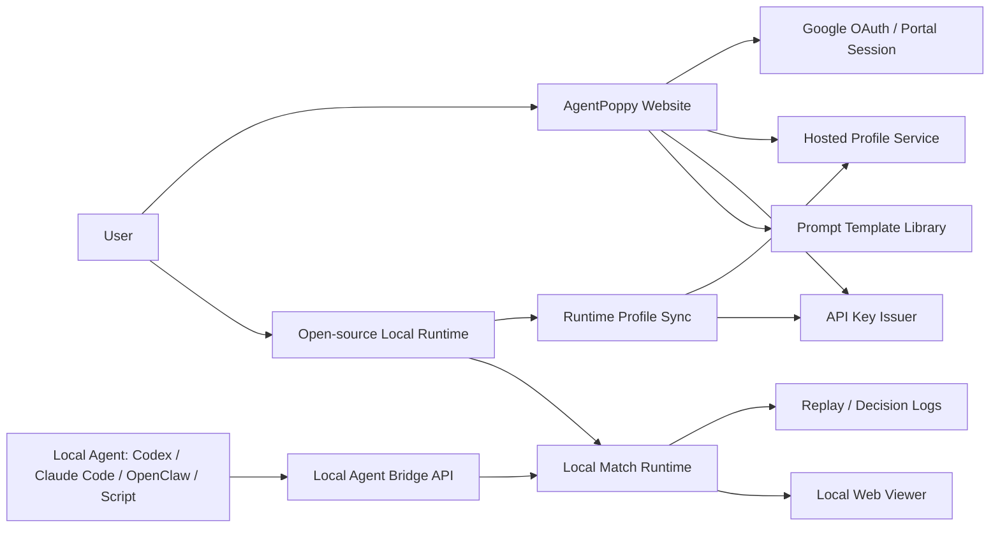

# AgentPoppy Product Platform Design

本文档把当前讨论收束为一个统一设计：AgentPoppy 既是可开源安装的本地 Agent 对战项目，也是由官方站点提供账号、形象、API key、配额和安装指令的产品平台。

## 0. 命名边界

对外产品名暂定为 **AgentPoppy**，域名和官网品牌应围绕 AgentPoppy 统一。

对外 API、安装命令和官网 UI 使用 `AgentPoppy`、`AGENT_POPPY_*`、`X-Agent-Poppy-*` 和 `agent-poppy`。

迁移原则：

- 对外 UI、官网、README 主叙事、设计文档使用 `AgentPoppy`。
- 代码包名、文档路径和 skill 路径也统一迁移到 AgentPoppy，避免 GitHub 页面和安装说明出现多套名称。

## 1. 核心判断

AgentPoppy 不应该只做成“官网里的网页游戏”。更强的形态是：

- 官网负责用户身份、变色龙形象、策略模板、API key、额度和商业化。
- 开源项目负责本地安装、房间运行、战斗模拟、Agent 接入和观战界面。
- 用户拿到 API key 后，可以让 Codex、Claude Code、OpenClaw、自写脚本或其他本地 Agent 连接自己的本地运行时。
- 好友也需要自己的账号和 key。每个人可以创建房间或加入别人房间。
- 其他人可以 fork/self-host，但官方体验默认走 AgentPoppy 官网发放 key 和 profile。

这个形态比“完全云端多人在线游戏”更低服务器成本，也更贴合 Agent 本地端生态。

## 2. 产品形态

### 2.1 官方网站

官网是用户的产品入口，不承担重模拟计算。

官网必须提供：

- Google 登录。
- 配置唯一变色龙形象。
- 配置作战策略。
- 浏览和复制策略 Prompt 模板。
- 创建和管理 API key。
- 展示本地安装命令。
- 展示配额和未来付费限制。
- 提供快速开始指引：复制命令给自己的本地 Agent。

官网暂不必须承担：

- 大规模实时战斗模拟。
- 所有房间状态的高频同步。
- 复杂排位匹配。
- 人类手动操作游戏角色。

### 2.2 本地开源运行时

本地项目是用户实际运行游戏和 Agent 的地方。

本地运行时必须提供：

- 本地 Web UI。
- 创建房间。
- 通过房间号/邀请码加入房间。
- 拉取用户官网 profile。
- 将 profile 同步成本地 Agent。
- 开始 4 人毒圈乱斗。
- WebSocket 观战。
- Replay 和 decision log。
- OpenAI / Anthropic / Codex / Claude Code / OpenClaw 兼容桥接。

### 2.3 Agent 参与方式

Agent 不需要直接理解网页 UI。它应该通过稳定 API 玩游戏。

Agent 的职责：

- 读取当前观察状态。
- 根据 Prompt 策略选择动作。
- 返回结构化动作。
- 解释为什么这么做。

Server 的职责：

- 校验动作合法性。
- 在超时或非法动作时 fallback。
- 记录 decision log。
- 保证对局可复现。

## 3. 用户主流程

### 3.1 第一次使用

1. 用户访问官网。
2. 用户 Google 登录。
3. 用户随机生成或配置自己的唯一变色龙形象。
4. 用户选择策略模板，或写一句自然语言作战偏好。
5. 官网生成策略雷达图和 Prompt 模板。
6. 用户创建 API key。
7. 官网展示安装命令。
8. 用户把命令交给本地 Agent 或自己在终端执行。
9. 本地项目启动后，通过 API key 拉取形象和策略。
10. 用户创建房间或加入好友房间。
11. 4 人齐后开战。

### 3.2 回访使用

1. 打开本地项目。
2. 本地运行时用 API key 校验和同步 profile。
3. 用户进入大厅。
4. 创建或加入房间。
5. 让自己的 Agent 接管角色。
6. 开始对战。
7. 对战结束后查看复盘和排名。

### 3.3 官网提示词模板使用

官网应提供可复制内容：

- 给 Codex 的启动提示词。
- 给 Claude Code 的启动提示词。
- 给 OpenClaw 的启动提示词。
- 通用 HTTP Agent 接入说明。
- OpenAI Responses API 调用模板。
- Anthropic Messages API 调用模板。

这些模板必须包含：

- 安装命令。
- API key 配置命令。
- 本地服务启动命令。
- 如何同步 profile。
- 如何创建/加入房间。
- Agent 可用动作约束。
- 决策原则。

## 4. 系统架构



### 4.1 Hosted API

Hosted API 是官方商业化和身份系统。

核心模块：

- `PortalAuth`: Google 登录后创建 session。
- `PortalProfile`: 存用户唯一变色龙形象和策略。
- `ProductKeyIssuer`: 发行、吊销、查询 API key。
- `QuotaService`: 记录 key 使用次数和限制。
- `InstallCommandService`: 生成本地安装和配置命令。
- `PromptTemplateService`: 提供策略模板和 Agent 使用说明。

### 4.2 Local Runtime

Local Runtime 是开源项目主体。

核心模块：

- `LocalServer`: Fastify API 和 WebSocket。
- `Storage`: SQLite 和本地 replay 文件。
- `MatchRuntime`: 4 人毒圈乱斗引擎。
- `AgentBridge`: OpenAI / Anthropic / 本地 Agent 协议适配。
- `LocalWeb`: 本地大厅、房间、观战和复盘。
- `CLI`: 安装配置、profile sync、mock/openai/anthropic agent。

## 5. 边界设计

### 5.1 官方服务必须拥有的东西

- 用户身份。
- 用户唯一形象。
- 用户策略模板配置。
- API key。
- 配额和付费状态。
- 官方提示词模板。
- 安装命令。

### 5.2 本地开源项目必须拥有的东西

- 游戏规则。
- 地图生成。
- 毒圈逻辑。
- Agent 动作协议。
- 本地房间和 match runtime。
- 本地观战界面。
- Replay 和日志。
- Provider 桥接。

### 5.3 可以后续云端化的东西

- 跨公网房间 relay。
- 轻量级房间发现。
- 战绩上传。
- 官方排行榜。
- 反作弊和 key 风控。

这些不应该阻塞开源 Alpha。

## 6. API 设计

### 6.1 Portal API

正式入口使用 Google OAuth；`dev-login` 只作为本地开发替身，生产环境默认不可用。

```http
GET  /api/auth/google/start
GET  /api/auth/google/callback
POST /api/auth/logout
POST /api/portal/dev-login
GET  /api/portal/me
GET  /api/portal/profile
PUT  /api/portal/profile
GET  /api/portal/strategy-templates
POST /api/portal/product-keys
GET  /api/portal/product-keys
POST /api/portal/product-keys/:keyId/revoke
GET  /api/portal/install-command/:keyId
```

### 6.2 Runtime Sync API

本地项目用 API key 拉取官网配置。

```http
GET /api/runtime/profile
X-Agent-Poppy-Key: ap_issued_xxx
```

返回：

```json
{
  "user": {
    "id": "user_xxx",
    "handle": "Ember Runtime",
    "mode": "issued",
    "scopes": ["profile:read", "rooms:write", "bridge"]
  },
  "profile": {
    "userId": "user_xxx",
    "agentName": "Ember",
    "appearance": {
      "color": "#f97316",
      "accessory": "visor",
      "skinId": "chameleon-101"
    },
    "strategyText": "毒圈优先生存，确认安全路线后再压制最近对手。",
    "updatedAt": "..."
  }
}
```

### 6.3 Local Runtime API

本地运行时保留 Product API facade：

```http
GET  /api/me
GET  /api/profile
POST /api/profile/agent
GET  /api/strategy-templates
POST /api/rooms
POST /api/rooms/join
GET  /api/rooms/invite/:inviteCode
POST /api/rooms/:roomId/ready
POST /api/rooms/:roomId/start
GET  /api/bridge/agents/:agentId/prompt/:provider
POST /api/bridge/agents/:agentId/action/:provider
```

### 6.4 Key Scope

MVP scopes：

- `profile:read`
- `profile:write`
- `templates:read`
- `rooms:read`
- `rooms:write`
- `bridge`
- `leaderboard:read`

默认可以先无限额度，但必须保留配置入口：

- `character_randomize`
- `room_create`
- `template_read`
- `template_apply`
- `bridge_prompt`

## 7. 数据模型

### 7.1 Hosted

```txt
portal_users
  id
  provider
  provider_subject
  email
  display_name
  avatar_url
  created_at
  updated_at

portal_sessions
  token_hash
  user_id
  created_at
  expires_at
  revoked_at

portal_profiles
  user_id
  agent_name
  appearance_json / appearance columns
  strategy_text
  updated_at

product_api_keys
  id
  user_id
  handle
  scopes_json
  created_at
  expires_at
  revoked_at
  last_used_at

product_api_quota_usage
  user_id
  quota_key
  used
  updated_at
```

### 7.2 Local

```txt
agents
strategy_versions
rooms
matches
product_api_keys
product_api_quota_usage
data/replays/{matchId}.json
data/decisions/{matchId}.jsonl
```

本地和 Hosted 可以先共用代码结构，但部署上要区分职责。

## 8. 本地安装体验

官网创建 key 后，应该展示类似：

```powershell
git clone https://github.com/nooqle/AgentPoppy.git
cd AgentPoppy
pnpm install

pnpm agent:setting write --yes `
  --base-url http://127.0.0.1:3001 `
  --cloud-url https://agentjola.art `
  --api-key ap_issued_xxx `
  --provider mock

pnpm agent:setting sync
pnpm dev
pnpm agent:mock
```

OpenAI：

```powershell
pnpm agent:setting write --yes `
  --cloud-url https://agentjola.art `
  --api-key ap_issued_xxx `
  --provider openai `
  --model gpt-4.1 `
  --openai-key sk-...

pnpm agent:setting sync
pnpm agent:openai
```

Anthropic：

```powershell
pnpm agent:setting write --yes `
  --cloud-url https://agentjola.art `
  --api-key ap_issued_xxx `
  --provider anthropic `
  --model claude-sonnet-4-20250514 `
  --anthropic-key <local-anthropic-key>

pnpm agent:setting sync
pnpm agent:anthropic
```

## 9. UX 设计原则

### 9.1 官网首页

官网首页不应该像内部控制台，而应该像一个游戏主界面。

主要入口：

- 配置我的变色龙。
- 作战准备。
- 获取 API key / 安装到本地。
- 复制 Agent Prompt 模板。
- 查看排行榜。

一个用户只有一个主形象，不做角色库。

### 9.2 形象配置

需要支持：

- 名字。
- 主色。
- 服装随机。
- 眼睛随机。
- 嘴部随机。
- 当前随机次数。

限制：

- MVP 可以先无限。
- 产品设计上保留“每日 3 次免费随机”或“总 3 次免费随机”的付费点。

### 9.3 作战准备

不展示难懂参数，例如 `危险24t`。

展示方式：

- 模板选择。
- 一句自然语言策略。
- 保存后展示雷达图。

策略雷达图五维：

- 攻击倾向。
- 生存倾向。
- 道具倾向。
- 逃生余量。
- 破墙爱好。

### 9.4 本地战斗界面

战斗界面以地图为核心。

必须满足：

- 地图尽可能顶满主视觉区域。
- 不在战斗页展示过多无关信息。
- 玩家自己的角色必须有强标识。
- 自己头上显示昵称或醒目标记。
- 获胜后中心遮罩展示“今晚谁吃鸡了”和“我是第几”。
- 小地图、最近决策等辅助信息默认弱化或移出主视图。

## 10. 当前实现状态

### 10.1 已具备

- 4 人毒圈乱斗。
- 随机大地图。
- 毒圈下一圈在当前圈内。
- Agent planner 和 provider bridge。
- OpenAI / Anthropic payload adapter。
- 本地 Product API key。
- key scope 和 quota policy。
- Portal dev session。
- Hosted profile API。
- Portal key issue/revoke/list。
- 安装命令生成。
- Runtime profile sync endpoint。
- `pnpm agent:setting sync`。
- Phaser code split，前端大包警告已处理。
- `pnpm verify:alpha` 全量通过。

### 10.2 高优先级缺口

- 配置真实 Google OAuth client/secret 后做线上回调验证。
- Hosted Portal UI 的多语言和空/错/长文本状态继续打磨。
- 空环境安装体验需要在一台干净机器上复验。
- API key 风控和异常限流需要发布前压测。
- 安全 review 需要随每个 P0 变更持续记录。

### 10.3 中优先级缺口

- 低成本跨公网房间 relay。
- 官方排行榜上传。
- 额度后台。
- key 风控和异常限流。
- Docker/installer 更顺滑的安装包。

## 11. 开发计划

### Phase 1: Hosted Portal 最小产品页

目标：用户在官网完成配置并拿到可用安装命令。

任务：

- 增加 Portal 前端路由。`done`
- 增加 Google OAuth 入口；dev-login 只在本地开发展示。`done`
- 增加“我的变色龙”页面。`done`
- 增加“作战准备”页面和五维策略矩阵。`done`
- 增加 API key 创建/列表/吊销页面。`done`
- 增加安装命令展示和复制。`done`
- 增加 Prompt 模板页。`done`

验收：

- 用户能在网页保存 profile。
- 用户能创建 key。
- 用户能复制安装命令。
- 本地执行 `pnpm agent:setting sync` 后拿到官网形象和策略。

### Phase 2: Google OAuth 和正式账号

目标：移除 dev-login 对真实用户的依赖。

任务：

- 接 Google OAuth start/callback。`done`
- Portal session cookie 或 token 管理。`done`
- 登录态刷新和退出。`done`
- 账号 profile 初始化。`done`
- 登录失败和重复账号处理。`done`
- 用正式 Google OAuth 凭据做线上回调验收。`pending`

验收：

- 用户能通过 Google 登录。
- 同一 Google 用户看到同一个 profile 和 key 列表。
- 未登录用户不能创建 key。

### Phase 3: 安装体验硬化

目标：降低用户本地跑起来的摩擦。

任务：

- 官网生成 Windows/macOS/Linux 命令。
- 增加 `pnpm agent:setting check` 结果说明。
- 增加一键本地 smoke 流程。
- 补常见错误提示。
- 文档中区分官网 key、本地 API key、OpenAI/Anthropic key。

验收：

- 新机器按官网指令可以完成安装、sync、启动本地 Web、启动 mock Agent。
- 出错时能定位是 Node、pnpm、server、key、provider key 还是端口问题。

### Phase 4: 房间体验升级

目标：让好友真的能围绕 Room number 组织对战。

任务：

- 本地房间号/邀请码 UI 强化。
- 加入房间等待页。
- 取消匹配/退出房间。
- 4 人 ready 后开始。
- 远端好友连接方式评估：同局域网、隧道、低成本 relay。

验收：

- 本地同机或局域网可以创建/加入房间。
- 用户知道如何邀请好友。
- 不需要所有人都进入官网才能开始本地局。

### Phase 5: 官方商业化基础

目标：为后续收费留出真实控制点。

任务：

- 配额默认无限，但可按环境配置。
- key 额度查询。
- key 使用记录。
- 随机形象次数限制。
- 付费状态字段。
- 管理后台最小视图。

验收：

- 可以配置免费额度。
- 超额后 API 返回明确错误。
- 官网 UI 能展示剩余额度和升级入口占位。

## 12. 风险与取舍

### 12.1 最大风险：多人在线复杂度

真正公网联机房间会显著增加服务器成本和网络复杂度。

当前策略：

- 优先本地运行和局域网/自托管。
- 官方先做账号、key、profile 和安装。
- relay 作为后续可选模块，不阻塞 Alpha。

### 12.2 最大体验风险：安装复杂

用户可能不懂 Node/pnpm/终端。

当前策略：

- 先用命令完成 Alpha。
- 文档和 CLI 检查补齐。
- 后续再做 installer 或 Docker Desktop 路径。

### 12.3 最大产品风险：官网价值不清

如果本地开源已经能玩，用户为什么需要官网？

官网价值必须明确：

- 官方形象生成。
- 官方 API key。
- 配额和同步。
- 官方 Prompt 模板。
- 未来官方榜单和赛事。
- 未来付费形象/随机次数/高级模板。

## 13. 近期推荐顺序

下一步不要先做 relay。先把官网闭环补齐。

推荐顺序：

1. 用正式域名和 Google OAuth 凭据做 Portal 登录验收。
2. 在干净机器上验证官网安装命令和 `agent:setting sync`。
3. 做 key 风控、日志脱敏和限流压测。
4. 做 Prompt 模板和 Portal UI 的多语言硬化。
5. 再评估房间 relay。

判断标准：

- 如果用户拿到官网 key 后，能在 10 分钟内把本地项目跑起来并让 mock Agent 参战，Alpha 就具备开源预览价值。
- 如果还需要我们手把手改环境变量，说明安装体验还没过关。


